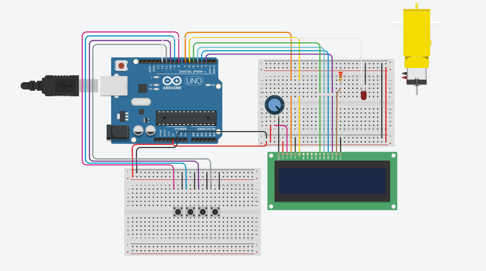

# Dispenser de Ração para Cachorros

Este projeto consiste em um dispenser de ração automático para cachorros. O dispenser é controlado por um Arduino e conta com um display LCD, um módulo RTC (Real-Time Clock) um relé para acionar um motor DC e liberação da ração.

## Requisitos

- Arduino
- Módulo RTC DS1307
- Display LCD
- Relé
- EEPROM

## Funcionalidades

- Definir alarmes para a liberação automática de ração em horários específicos.
- Configurar a quantidade de porções de ração a serem liberadas em cada alarme.
- Visualizar a hora atual no display LCD.
- Menu interativo para configuração dos alarmes e horários.

## Configuração

1. Conecte o módulo RTC ao Arduino.
2. Conecte o display LCD ao Arduino.
3. Conecte o relé ao Arduino.
4. Certifique-se de ter as bibliotecas instalada no seu ambiente Arduino.

## Como usar

1. Compile e faça o upload do código para o Arduino.
2. Ao ligar o sistema, a hora atual será exibida no display.
3. Pressione o botão "MENU" para acessar o menu principal.
4. Use os botões "UP" e "DOWN" para navegar pelo menu e selecionar as opções desejadas.
5. Para configurar um alarme, selecione a opção "SET ALARM" no menu.
6. Selecione o alarme desejado (0 ou 1) e configure a hora, os minutos e a quantidade de porções de ração.
7. Pressione o botão "EXIT" para confirmar as configurações e salvar o alarme e voltar ao menu anterio.
8. Para visualizar ou modificar os alarmes configurados, acesse o menu principal e selecione a opção "SET ALARM".
9. Para sair do menu pressione o botão "EXIT".
10. O dispenser de ração será acionado automaticamente nos horários configurados.

## Observações

- Certifique-se de que o módulo RTC esteja configurado corretamente com a data e hora atual.
- Para ajustar a hora do modulo RTC, descomente a linha do codgo indicado no void setup
- Para limpar a memória EEPROM do Arduino, descomente o trecho de código indicado no void setup.
- Certifique-se de ter instalado a biblioteca RTClib no seu ambiente Arduino.
